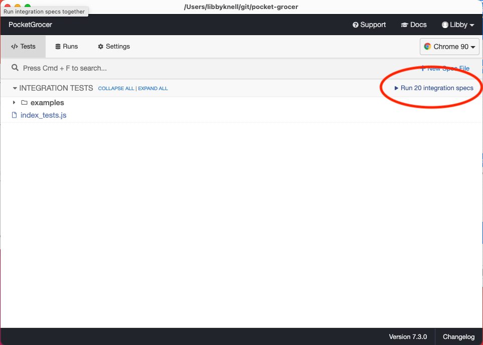

# DEVELOPER GUIDELINES
Thank you so much for your interest in contributing to Pocket Grocer! We appreciate you.

# How to contribute

## Obtaining source code
The PocketGrocer web app uses multiple repositories. This is the repository containing all of the front end code, and [this repository](https://github.com/shaurya2109/pg-backend) contains all of the back end code.

Please clone both repositories before getting started.

## Directory structure
* .github/workflows
    * main_pocket-grocer-403.yml - build and deploy script
    * main.yml - cypress testing script
* cypress/integration
    *  cypress testing files (add tests here)
* public
    * main html files for all pages (add new HTML here)
    * assets
        * css
            * stylesheets (add new CSS here)
        * js
            * javascript files (add new JS here)
        * sass
            * compiled css from original template (we don't edit this folder)
        * webfonts
            * font awesome fonts
    * images
        * contains background images and icons
    * reports
        * weekly reports

## Build process
To build the system, navigate to the root directory of the pocket-grocer repo first run the following:
```
npm install
```
Followed by:
```
npm start
```
Now visit localhost:8000 in your browser of choice, and you should see the front end of the Pocket Grocer website

## Test process
To test the system, use the CLI and navigate to the root directory of the pocket-grocer repo and run:
```
npm install cypress --save-dev
```
Then, 
```
node_modules/.bin/cypress open
```
This should open a Cypress in a new window - you will see a list of all integration tests. 
Click "Run [some number] integration specs" and this will run all Cypress tests.



## Adding new tests
Add new tests to cypress/integration folder. Please use the naming convention <name of html file>_tests.js. The [Cypress documentation](https://docs.cypress.io/guides/getting-started/writing-your-first-test#Step-1-Visit-a-page) is extremely useful for getting started.

## Build/Release
@FADEL?
How to build a release of the software. Describe any tasks that are not automated. For example, should a developer update a version number (in code and documentation) prior to invoking the build system? Are there any sanity checks a developer should perform after building a release?

## Coding conventions
In order to sanitize coding standards, please follow [this HTML style guide](https://courses.cs.washington.edu/courses/cse154/codequalityguide/html/), [this CSS style guide](https://courses.cs.washington.edu/courses/cse154/codequalityguide/css/), and [this JavaScript style guide](https://courses.cs.washington.edu/courses/cse154/codequalityguide/javascript/).


